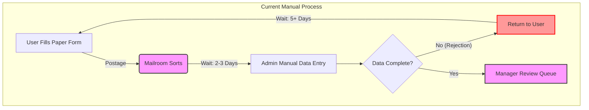
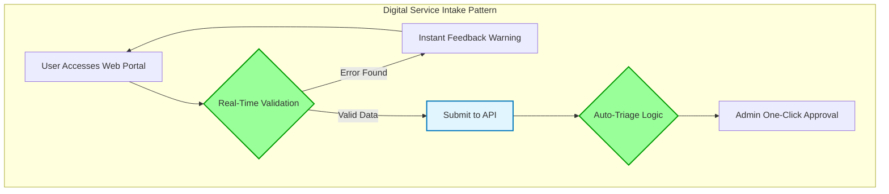

# The 'Right-First-Time' Intake Pattern

**Technical Business Analyst Portfolio | Public Sector Digital Optimisation**

## The Problem
In high-volume public sector intake (DWP benefits, NHS referrals, Local Government permits), **30% of submissions fail initial validation** due to missing or conflicting data. This creates "swivel chair" rework for caseworkers and delays for citizens.

## The Solution
A **Smart Intake** workflow that validates evidence *before* it reaches the decision-maker, while maintaining public sector standards (accessibility, audit, GDPR).

## 🔄 1. Process Analysis (The "As-Is" vs "To-Be")
*Visualising the shift from manual failure demand to automated triage.*

### The "To-Be" Optimization (Smart Intake)
*Automated triage reduces administrative burden by 90%.*

## 📂 2. Portfolio Artefacts

### Discovery & Learning
*Stakeholder engagement and requirement elicitation.*
- [📄 Stakeholder Questions & Plan](./discovery/stakeholder-questions.md)
  *Structured interview guide for Policy, Ops, and Technical SMEs.*

### Requirements Engineering
*Behaviour-Driven Development specifications.*
- [📄 Intake Validation Scenarios](./src/features/triage.feature)
  *Gherkin feature file including validation logic for catchment areas.*
- [📄 Accessibility Requirements](./src/features/accessibility.feature)
  *WCAG 2.1 AA compliance scenarios for screen readers.*

### Data Specifications
*Technical implementation details for developer handoff.*
- [📄 Submission Payload Schema](./src/data-specs/submission-payload.json)
  *JSON schema defining the API contract and data structure.*

### Governance & Compliance
*Public sector risk management.*
- [📄 Decision Log](./governance/decision-log.md)
  *Record of architectural and design choices.*
- [📄 Accessibility Statement](./governance/accessibility-statement.md)
  *Compliance methodology (Pa11y, NVDA testing).*

## ⚖️ License & Attribution

**Codebase:**
The code in this repository is licensed under the [MIT License](LICENSE).

**Design System & Content:**
This project utilizes patterns and components from the [GOV.UK Design System](https://design-system.service.gov.uk/), which is © Crown copyright and licensed under the [Open Government Licence v3.0](https://www.nationalarchives.gov.uk/doc/open-government-licence/version/3/).

*Note: This is a simulation for educational purposes and is not an official government service.*
